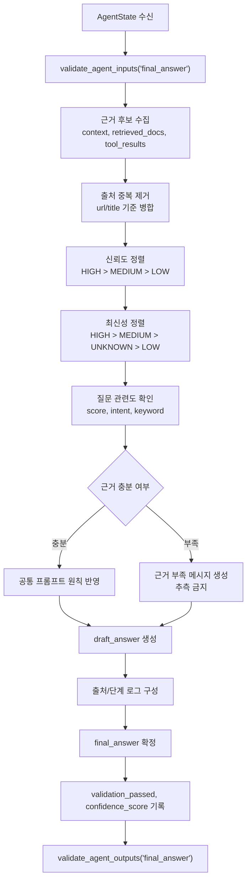

# SKN27-3rd-1TEAM

```mermaid
flowchart TD
    A["AgentState 수신"] --> B["validate_agent_inputs('final_answer')"]
    B --> C["근거 후보 수집<br/>context, retrieved_docs, tool_results"]
    C --> D["출처 중복 제거<br/>url/title 기준 병합"]
    D --> E["신뢰도 정렬<br/>HIGH > MEDIUM > LOW"]
    E --> F["최신성 정렬<br/>HIGH > MEDIUM > UNKNOWN > LOW"]
    F --> G["질문 관련도 확인<br/>score, intent, keyword"]
    G --> H{"근거 충분 여부"}

    H -->|"충분"| I["공통 프롬프트 원칙 반영"]
    H -->|"부족"| J["근거 부족 메시지 생성<br/>추측 금지"]

    I --> K["draft_answer 생성"]
    J --> K
    K --> L["출처/단계 로그 구성"]
    L --> M["final_answer 확정"]
    M --> N["validation_passed, confidence_score 기록"]
    N --> O["validate_agent_outputs('final_answer')"]
```
