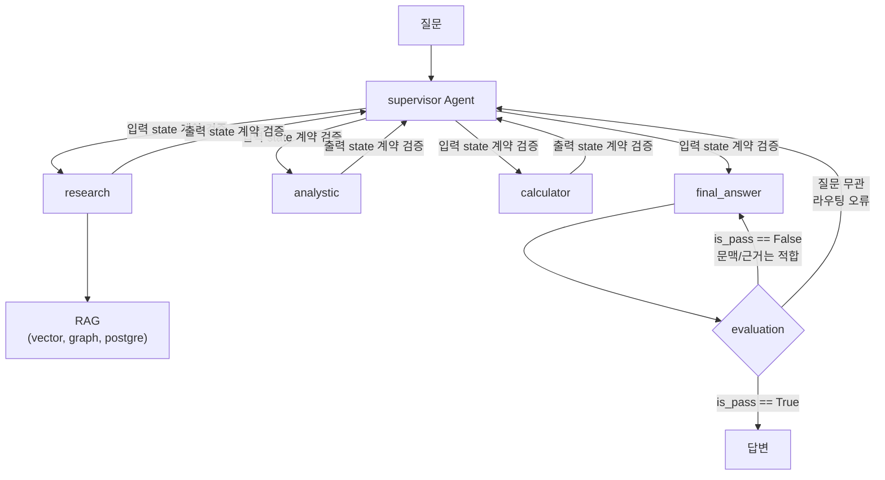

# SKN27-3rd-1TEAM

```mermaid
flowchart TD
    A["질문"] --> B["supervisor Agent"]

    B -->|"입력 state 계약 검증"| D["research"]
    B -->|"입력 state 계약 검증"| E["analystic"]
    B -->|"입력 state 계약 검증"| F["calculator"]

    D --> D1["RAG<br/>(vector, graph, postgre)"]
    D -->|"출력 state 계약 검증"| B
    E -->|"출력 state 계약 검증"| B
    F -->|"출력 state 계약 검증"| B
    B -->|"입력 state 계약 검증"| G["final_answer"]
    G --> H{"evaluation"}
    H -->|"is_pass == True"| I["답변"]
    H -->|"is_pass == False<br/>문맥/근거는 적합"| G
    H -->|"질문 무관<br/>라우팅 오류"| B
```
