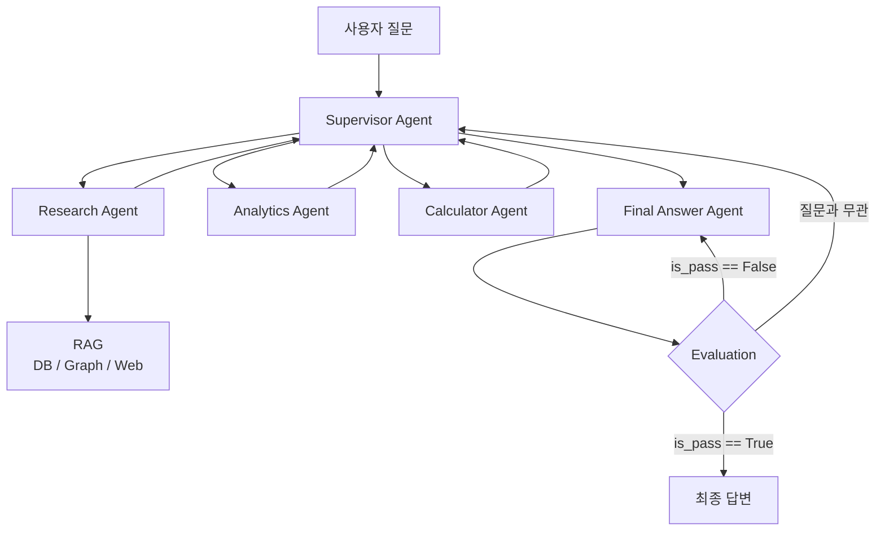
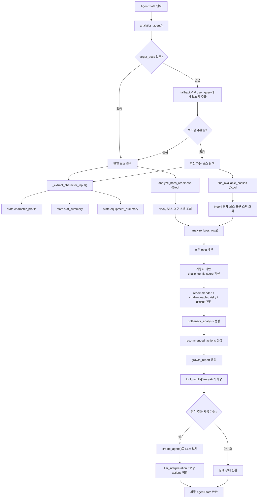
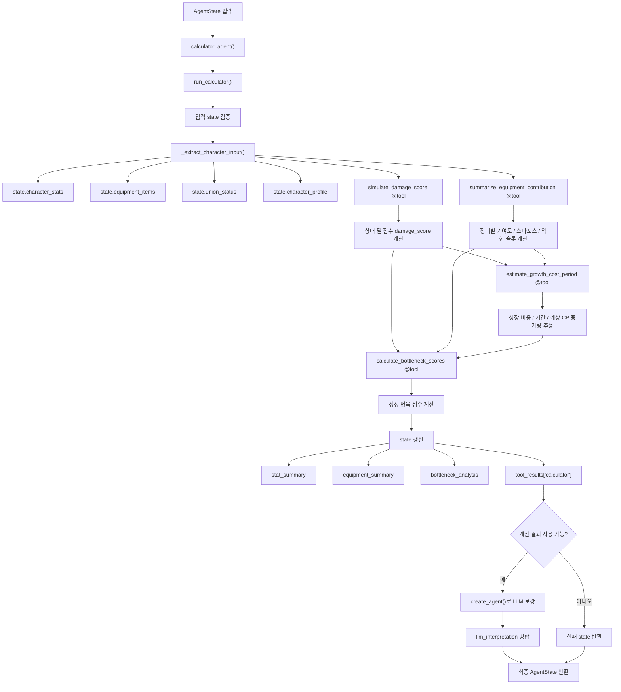
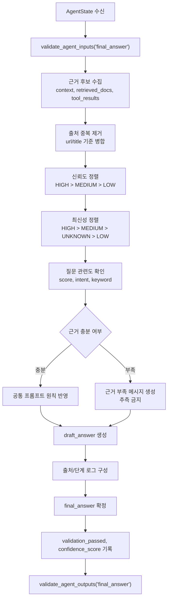
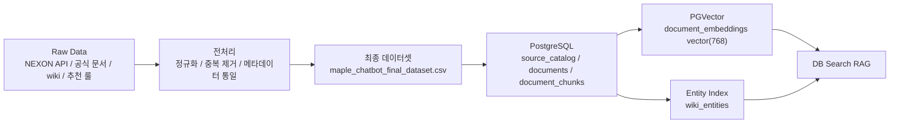

# **SKN27-3rd-1TEAM**

> SK Networks Family AI Camp 27기 3차 프로젝트<br>
> 개발기간: 2026년 5월 1일 ~ 15일

<br>

---

# Contents

1. [팀 소개](#1-팀-소개)
2. [프로젝트 개요](#2-프로젝트-개요)
3. [기술 스택 및 사용 모델](#3-기술-스택-및-사용-모델)
4. [시스템 아키텍처 및 구조](#4-시스템-아키텍처-및-구조)
5. [주요 기능](#5-주요-기능)
6. [데이터 파이프라인 및 DB 적재](#6-데이터-파이프라인-및-db-적재)
7. [RAG](#7-rag)
8. [테스트 및 결과](#8-테스트-및-결과)
9. [향후 서비스 방향](#9-향후-서비스-방향)
10. [결론](#10-결론)
11. [회고](#11-회고)
<br>

---

# 1. 팀 소개

#### 팀명: 자리요!

#### 프로젝트명: 메이플스토리 데이터 기반 RAG 멀티 에이전트 챗봇

<br>

##### 팀원 소개

<table align="center" width="100%">
  <tr>
    <td align="center"></td>
    <td align="center"></td>
    <td align="center"></td>
    <td align="center"></td>
    <td align="center"></td>
  </tr>
  <tr>
    <td align="center"><b>김민경</b></td>
    <td align="center"><b>권환성</b></td>
    <td align="center"><b>김주영</b></td>
    <td align="center"><b>신동혁</b></td>
    <td align="center"><b>한재웅</b></td>
  </tr>
  <tr>
    <td align="center">팀장</td>
    <td align="center">팀원</td>
    <td align="center">팀원</td>
    <td align="center">팀원</td>
    <td align="center">팀원</td>
  </tr>
  <tr>
    <td align="center"><a href="https://github.com/m2k-dcyh13">GitHub</a></td>
    <td align="center"><a href="https://github.com/nanseong">GitHub</a></td>
    <td align="center"><a href="https://github.com/enooola0204-spec">GitHub</a></td>
    <td align="center"><a href="https://github.com/techshin31">GitHub</a></td>
    <td align="center"><a href="https://github.com/hjoo10200">GitHub</a></td>
  </tr>
  <tr>
    <td align="center">프로젝트 구조<br>요구사항 정의<br>Supervisor Agent<br>Streamlit Chatbot<br>코드 통합<br>WBS</td>
    <td align="center">GraphDB 스키마<br>Neo4j<br>Web Search RAG<br>Final Answer Agent<br>Design</td>
    <td align="center">ERD<br>PostgreSQL/PGVector<br>DB Search RAG<br>RAGAS<br>README</td>
    <td align="center">기획서<br>화면설계서<br>데이터셋 확보/전처리<br>Research Agent<br>Evaluation<br>API 연동</td>
    <td align="center">Analytics Agent<br>Calculator Agent<br>미니게임 설계</td>
  </tr>
</table>

<br>

---

# 2. 프로젝트 개요

### 프로젝트 소개

- 메이플스토리 공식 API, 공지사항, 이벤트, 업데이트 문서, 보스/직업/장비 데이터 기반 RAG 챗봇
- 캐릭터 상태 분석, 장비 기반 계산, 그래프 관계 탐색, 웹 검색 검증, 최종 답변 생성의 MultiAgent 역할 분리
- 단순 문서 검색을 넘어선 신뢰도 높은 답변 제공

<div align="center">
  
</div>

<br>

### 프로젝트 필요성

- 장기간 서비스로 축적된 방대한 직업, 장비, 보스, 이벤트, 패치 정보
- 잦은 업데이트로 인한 정보 변경과 최신성 확인 부담
- 공식 홈페이지, 공지사항, 이벤트 페이지, 커뮤니티, 위키를 직접 확인해야 하는 탐색 비용
- 복귀/신규 유저의 성장 우선순위 판단 어려움

해결 대상 문제

- 최신 이벤트 및 패치 정보를 빠르게 확인하기 어려움
- 캐릭터 상태에 맞는 성장 방향 판단이 어려움
- 보스 도전 가능 여부와 장비 우선순위 판단이 어려움
- 공식 문서와 커뮤니티 정보의 신뢰도를 구분하기 어려움
- 여러 데이터베이스와 검색 결과를 종합한 답변 생성이 필요함

#### 타 서비스 비교

| 구분 | 일반 검색/위키 | 커뮤니티 질문 | 메이플 정보 사이트 | 본 프로젝트 |
|---|---|---|---|---|
| 정보 범위 | 문서 단위 검색 | 사용자 경험 중심 | 랭킹/아이템/시세 중심 | 공식 문서, 위키, API, 추천 룰 통합 |
| 최신성 | 직접 확인 필요 | 답변 시점 의존 | 제공 범위별 상이 | Web RAG 기반 최신 공지 보강 |
| 개인화 | 낮음 | 질문자 설명 의존 | 일부 캐릭터 조회 중심 | NEXON API 기반 캐릭터 상태 분석 |
| 근거 추적 | 출처 직접 확인 | 근거 누락 가능 | 화면 정보 중심 | 출처, 신뢰도, 최신성 메타데이터 관리 |
| 추천 방식 | 사용자가 직접 판단 | 답변자 숙련도 의존 | 정적 지표 중심 | MultiAgent 기반 검색, 분석, 계산, 최종 답변 분리 |
| 확장성 | 검색 결과 의존 | 재현성 낮음 | 기능 범위 고정 | PostgreSQL/PGVector, Neo4j, Web RAG 병행 |

<br>

#### 시장성

- 장기간 운영 게임 특성상 누적된 정보량과 높은 탐색 비용
- 신규/복귀 유저의 성장 루트, 보스 컷, 장비 우선순위 판단 수요
- 패치, 이벤트, 테스트월드 업데이트에 따른 지속적 정보 갱신 수요
- 캐릭터 API 기반 개인화 분석 서비스로 확장 가능한 구조
- 챗봇, 보스 추천, 장비 성장 계산, 미니게임을 결합한 서비스형 UI 확장성
- 커뮤니티 의존 답변을 공식 근거 기반 답변으로 전환할 수 있는 가능성

<br>

### 프로젝트 목표

- NEXON Open API 기반 캐릭터, 장비, 스탯 데이터 활용
- 공식 공지, 이벤트, 업데이트 문서 기반 Web Search RAG 구현
- Neo4j GraphDB 기반 직업, 보스, 아이템, 이벤트 관계 탐색
- PostgreSQL 및 PGVector 기반 문서 검색 구조 설계
- LangGraph 기반 MultiAgent 답변 처리 흐름 구현
- Streamlit 기반 챗봇 UI 제공
- Streamlit 기반 미니게임 기능 제공

### 데이터 기반 설계 특징

- 공식 API 샘플, 공식 문서, 위키 문서, 추천 룰, 검수 가드레일을 하나로 묶은 RAG용 통합 데이터셋
- `maple_chatbot_final_dataset.csv` 기준 총 3,567행, 25개 컬럼, 약 70MB 규모
- 모든 행 `rag_ready=True`, 즉시 임베딩 및 검색 인덱싱 가능

### 기대 효과

- 공식/위키/API/추천 룰 통합을 통한 답변 일관성 강화
- 신뢰도/출처 메타데이터 기반 근거 추적성 확보
- 실시간 API 연동을 통한 캐릭터 분석, 보스 추천, 장비 성장 추천 확장
- PostgreSQL/PGVector와 Neo4j 역할 분리를 통한 문서 검색 및 관계 탐색 병행

<br>

---

# 3. 기술 스택 및 사용 모델

## 기술 스택 및 사용한 모델

<table>
  <thead>
    <tr>
      <th align="center">분류</th>
      <th align="center">기술</th>
    </tr>
  </thead>
  <tbody>
    <tr>
      <td align="center">협업 및 형상 관리</td>
      <td>
        
      </td>
    </tr>
    <tr>
      <td align="center">개발 언어</td>
      <td>
        
      </td>
    </tr>
    <tr>
      <td align="center">프론트엔드</td>
      <td>
        
      </td>
    </tr>
    <tr>
      <td align="center">Agent Framework</td>
      <td>
        
        
      </td>
    </tr>
    <tr>
      <td align="center">LLM</td>
      <td>
        
      </td>
    </tr>
    <tr>
      <td align="center">Embedding</td>
      <td>
        
        
      </td>
    </tr>
    <tr>
      <td align="center">Database</td>
      <td>
        
        
        
      </td>
    </tr>
    <tr>
      <td align="center">Web Search</td>
      <td>
        
      </td>
    </tr>
    <tr>
      <td align="center">Infra</td>
      <td>
        
        
      </td>
    </tr>
  </tbody>
</table>

<br>

---

# 4. 시스템 아키텍처 및 구조

## 아키텍처



## Supervisor Agent

<div align="center">
  
</div>

## 프로젝트 구조

```text
SKN27-3rd-1TEAM/
├─ app/
│  └─ streamlit_app.py              # Streamlit 화면
│
├─ common/
│  ├─ domain.py                     # 공통 데이터 모델
│  ├─ config.py                     # 환경변수, 설정
│  └─ constants.py                  # 공통 상수
│
├─ database/
│  ├─ data
│  ├─ postgres/                     # PostgreSQL + PGVector
│  ├─ neo4j/                        # GraphDB
│  └─ docker-compose.yml
│
├─ docs/
│  ├─ openapi.yaml
│  ├─ wbs.csv
│  ├─ erd.md
│  └─ graph_schema.md
│
├─ src/
│  ├─ collectors/                   # 공식 API, 공지, 이벤트, 패치노트 수집
│  │  ├─ nexon_api.py
│  │  ├─ notice_crawler.py
│  │  └─ event_crawler.py
│  │
│  ├─ preprocessing/                # 정제, 청킹
│  │
│  ├─ rag/
│  │  ├─ db_search.py               # DB Search RAG
│  │  ├─ web_search.py              # Web Search RAG
│  │  └─ retriever.py
│  │
│  ├─ agents/
│  │  ├─ supervisor.py
│  │  ├─ researcher.py
│  │  ├─ analyst.py
│  │  ├─ calculator.py
│  │  └─ final_answer.py
│  │
│  ├─ services/
│  │  ├─ character_service.py       # 캐릭터 조회/통합
│  │  ├─ analysis_service.py        # 보스 판단, 병목 분석
│  │  └─ recommendation_service.py  # 성장 추천
│  │
│  ├─ minigame/                     # Streamlit 미니게임 로직 및 화면
│  │
│  └─ evaluation/
│     ├─ ragas_eval.py
│     └─ answer_eval.py
│
├─ requirements.txt
├─ README.md
└─ setup-guide.md
```

## ERD

<div align="center">
  
  <br>
  
</div>

## 화면 설계서

#### 1. 참고 구조

<div align="center">
  
</div>

#### 2. 홈

<div align="center">
  
</div>

#### 3. 메이플 봇

<div align="center">
  
</div>

#### 4. 내 캐릭터

<div align="center">
  
</div>

#### 5. 보스컷

<div align="center">
  
</div>

#### 6. 성장플랜

<div align="center">
  
</div>

#### 7. 스타포스

<div align="center">
  
</div>

#### 8. 큐브

<div align="center">
  
</div>

#### 9. 랭킹

<div align="center">
  
</div>

#### 10. 히스토리

<div align="center">
  
</div>

## Agent 역할

| Agent | 역할 |
|---|---|
| Supervisor Agent | 사용자 질문 분석, 작업 계획 수립, 다음 Agent 라우팅 |
| Research Agent | DB RAG, Graph RAG, Web Search RAG를 활용한 정보 검색 |
| Analytics Agent | 캐릭터 상태 분석 및 성장 방향 진단 |
| Calculator Agent | 장비와 스탯 기반 계산 및 전투력 관련 보조 분석 |
| Final Answer Agent | 각 Agent 결과를 종합하여 사용자 답변 생성 |
| Evaluation | 최종 답변의 적절성, 문맥 일치성, 근거 충실성 검증 |

## Agent 책임 분리 기준

| 영역 | 책임 |
|---|---|
| DB Search RAG | 답변 생성이 아닌 근거 검색 |
| Web Search RAG | 최신 공식 웹 문서 검색 |
| GraphDB RAG | 보스, 직업, 장비, 보상 관계 조회 |
| Final Answer Agent | 검색/분석/계산 결과 종합 |
| Evaluation | 답변 품질, 문맥 일치성, 근거 충실성 검증 |

## GraphDB 지식 구조

| 노드 | 활용 |
|---|---|
| Job | 직업, 직업군, 주스탯 |
| Boss | 보스명, 난이도, 요구 레벨 |
| StatRequirement | 보스/콘텐츠 요구 스펙 |
| EquipmentCatalog | 장비 카탈로그 |
| SetEffect | 장비 세트 효과 |
| Event | 이벤트 정보 |
| Reward | 보상 정보 |
| Source | 문서 출처 연결 |

## Analytics Agent 흐름도



## Calculator Agent 흐름도



## Final Answer Agent 흐름도



<br>

---

# 5. 주요 기능

| 기능 | 설명 |
|---|---|
| 캐릭터 정보 조회 | NEXON Open API를 활용하여 캐릭터 기본 정보, 장비, 스탯 조회 |
| Web Search RAG | Tavily 기반 공식 공지, 이벤트, 업데이트 문서 검색 |
| GraphDB RAG | Neo4j 기반 직업, 보스, 장비, 이벤트 관계 탐색 |
| DB Search RAG | PostgreSQL, PGVector 기반 문서 검색 |
| 캐릭터 분석 | 캐릭터 상태, 보스 도전 가능성, 성장 병목 분석 |
| 장비 계산 | 장비와 스탯 기반 전투력 관련 보조 계산 |
| 최종 답변 생성 | 여러 Agent의 결과를 종합하여 사용자 친화적 답변 생성 |
| 답변 평가 | 답변의 통과 여부에 따라 재생성 또는 Supervisor 재계획 수행 |
| 미니게임 | 사용자가 챗봇 외에도 가볍게 이용할 수 있는 Streamlit 기반 부가 기능 |

### 기능별 설계 이유

| 기능/구성 | 설계 이유 | 다른 방식 대비 장점 |
|---|---|---|
| MultiAgent 구조 | 질문 분석, 검색, 분석, 계산, 답변 생성 역할 분리 | 단일 Agent 대비 디버깅, 확장, 재시도 용이 |
| Supervisor Agent | 사용자 의도 기반 작업 계획과 Agent 라우팅 | 고정 순차 실행 대비 질문 유형별 유연한 흐름 |
| DB Search RAG | 적재된 공식/위키/룰 문서의 안정 검색 | 매번 웹 검색 대비 빠른 응답과 재현성 |
| Keyword + Vector Hybrid | 고유명사 검색과 의미 검색 동시 보완 | keyword-only/vector-only 대비 검색 누락 감소 |
| GraphDB RAG | 보스, 직업, 장비, 보상 관계 구조화 | 문서 유사도 검색 대비 관계 질의 정확도 |
| Web Search RAG | 최신 공지/이벤트/업데이트 실시간 보강 | DB 고정 데이터 대비 최신성 확보 |
| PostgreSQL/PGVector | 문서, 청크, 임베딩의 한 저장소 관리 | 별도 VectorDB 대비 운영 단순화 |
| Final Answer Agent | 근거, 출처, 분석 결과의 최종 종합 | Agent별 개별 답변 생성 대비 응답 일관성 |
| Evaluation/RAGAS | 검색 품질과 답변 근거성 수치화 | 수동 검수 대비 객관적 비교 기준 |
| Streamlit Chatbot/미니게임 | 챗봇 사용성과 부가 경험 동시 제공 | 콘솔 실행 대비 시연 친화적 화면 |

<br>

---

# 6. 데이터 파이프라인 및 DB 적재

### 데이터 파이프라인



### 데이터 적재 의도

| 구분 | 적재 의도 | 설계 이유 |
|---|---|---|
| 원천 데이터 | 공식 API, 공식 문서, 위키, 추천 룰 수집 | 답변 근거 범위 확보 |
| 전처리 데이터 | 문서 형식, 출처, 카테고리, 신뢰도 통일 | RAG 검색 조건 표준화 |
| PostgreSQL | 문서 원문, 청크, 출처, 엔티티 색인 관리 | 정형 메타데이터와 검색 근거 통합 |
| PGVector | 청크 단위 임베딩 저장 | 의미 기반 문서 검색 |
| wiki_entities | 보스, 몬스터, 스킬, 아이템, 퀘스트, 맵 색인 | 고유명사 검색 보강 |
| DB dump | 팀원 간 동일 DB 상태 공유 | 실행 환경 재현성 확보 |

### 주요 기능별 데이터 연결

| 주요 기능 | 연결 데이터/테이블 | 활용 포인트 |
|---|---|---|
| 캐릭터 정보 조회 | `characters`, `char_stat`, `char_equipment`, NEXON Open API | 캐릭터 기본 정보, 스탯, 장비 기준 데이터 |
| DB Search RAG | `documents`, `document_chunks`, `document_embeddings`, `wiki_entities` | 공식/위키/추천 룰 기반 근거 검색 |
| GraphDB RAG | Neo4j 직업, 보스, 장비, 이벤트 관계 데이터 | 관계형 질의와 보스 요구 스펙 탐색 |
| Web Search RAG | 공식 공지, 이벤트, 업데이트, 테스트월드 문서 | 최신 정보 보강 |
| 캐릭터 분석 | `char_stat`, `char_equipment`, `analysis_reports` | 보스 도전 가능성, 성장 병목 진단 |
| 장비 계산 | `char_equipment`, `char_set_effects`, 장비 옵션 데이터 | 장비별 기여도, 스타포스, 성장 우선순위 |
| 최종 답변 생성 | RAG 검색 결과, Agent 결과, 출처 메타데이터 | 근거 기반 최종 응답 조합 |
| 답변 평가 | `docs/ragas_report.md`, RAGAS 평가 결과 | 검색 품질과 답변 근거성 검증 |
| 미니게임 | Streamlit 화면 데이터, 캐릭터/랭킹 연계 가능 데이터 | 챗봇 외 부가 사용자 경험 |


---

# 7. RAG

### 데이터 수집

| 데이터 출처 | 활용 내용 |
|---|---|
| NEXON Open API | 캐릭터, 장비, 스탯, 유니온, 랭킹 등 정형 데이터 |
| 메이플스토리 공식 공지사항 | 점검, 오류, 보상, 운영 공지 |
| 메이플스토리 공식 업데이트 | 패치노트, 스킬 변경, 신규 콘텐츠 |
| 메이플스토리 공식 이벤트 | 이벤트 기간, 참여 조건, 보상 정보 |
| 테스트월드 공지 | 향후 업데이트 가능성 분석 보조 |
| 보조 문서 데이터셋 | RAG 검색 및 답변 근거 보강 |

### RAG 역할 분리

| RAG | 핵심 역할 | 강점 |
|---|---|---|
| PGVector RAG | 문서 근거 검색 | 공식 문서, 위키, 추천 룰 |
| GraphDB RAG | 구조화 관계 검색 | 보스 요구 스펙, 직업 주스탯, 장비 세트 |
| Web RAG | 최신 웹 문서 검색 | 진행 이벤트, 최신 공지, 업데이트 확인 |

### 최종 RAG 데이터셋 구성

| 구성 범위 | 행 수 | 활용 목적 |
|---|---:|---|
| NEXON API 정적 샘플 | 1,824 | 캐릭터/장비/스탯/유니온 API 구조 분석 |
| 추가 수집 wiki 문서 | 1,338 | 보스, 장비, 스킬, 맵, 퀘스트 등 게임 지식 검색 |
| 공식 문서 | 67 | 공지, 이벤트, 업데이트, 테스트월드 정보 검색 |
| 보스/장비 추천 룰 | 197 | 보스 추천 및 장비 성장 추천 기준 |
| 추천 검수/가드레일 보강 데이터 | 27 | 안전한 추천 답변 생성 기준 |
| 한국어 스토리 요약 seed | 12 | 지역/스토리 기반 Q&A 보강 |
| 직업별 5차 코어 우선순위 seed | 47 | 직업별 코어 강화 조언 |
| 직업별 6차 HEXA 우선순위 seed | 47 | HEXA 성장 우선순위 조언 |
| 시세/이벤트 강화 타이밍 seed | 8 | 스타포스/큐브 이벤트 판단 보조 |

### DB 적재 현황

| 항목 | 값 |
|---|---:|
| documents | 3,567 |
| document_chunks | 10,069 |
| document_embeddings | 10,069 |
| wiki_entities | 1,328 |
| 미임베딩 chunk | 0 |
| embedding model | `google/embeddinggemma-300m` |
| vector dimension | 768 |

### DB Search RAG

PostgreSQL/PGVector 기반 문서 청크 검색, 벡터 검색, 위키 엔티티 색인 검색 구조

### GraphDB RAG

Neo4j 기반 직업, 보스, 장비, 이벤트, 요구 스탯 관계 탐색

### Web Search RAG

Tavily 기반 공식 공지, 이벤트, 업데이트 문서 검색 및 최신 정보 보강

### Web RAG 신뢰도 기준

| 기준 | 내용 |
|---|---|
| 공식 도메인 | `maplestory.nexon.com`, `openapi.nexon.com`, `notice.nexon.com` |
| 공식 출처 | reliability HIGH |
| 커뮤니티 출처 | reliability MEDIUM |
| 최신성 HIGH | 발행일 기준 90일 이내 |
| 최신성 MEDIUM | 발행일 기준 1년 이내 |
| 최신성 LOW | 발행일 기준 1년 초과 |

### RAG 개발 흐름

1. `maple_chatbot_final_dataset.csv` 로드
2. `rag_ready=True` 문서의 `rag_text` 임베딩
3. `category`, `collection_scope`, `trust_level`, `source_url` 메타데이터 유지
4. 일반 Q&A는 wiki/official 문서 중심 검색
5. 보스/장비 추천은 `supplemental_recommendation_rules` 기준 룰 사용
6. 추천 답변 문구는 `supplemental_recommendation_review_support` 가드레일 참고
7. NEXON Open API 실시간 연동 후 캐릭터명 기반 개인화 추천 확장

<br>

---

# 8. 테스트 및 결과

### 챗봇 시연 결과

<div align="center">
  
</div>

### 미니게임 시연 결과

<div align="center">
  
</div>

<br>

---

# 9. 향후 서비스 방향

- NEXON Open API 실시간 연동을 통해 캐릭터명 기반 개인화 추천 고도화
- 보스 컷, 장비 성장 수치, 보상 가치 기준에 대한 팀 검수 및 최신화
- 스타포스/큐브 이벤트, 서버별 시세 데이터 연동을 통한 강화 타이밍 추천 개선
- 직업별 5차 코어/6차 HEXA 강화 우선순위 데이터 검수 및 세분화
- 이벤트 이미지 OCR 데이터 추가 수집을 통한 이벤트 정보 검색 범위 확장

<br>

---

# 10. 결론

- 메이플스토리 공식 API, 공식 문서, 위키 문서, 추천 룰 데이터 통합
- RAG 기반 챗봇의 검색 근거 체계화
- PostgreSQL/PGVector 기반 문서 검색 및 근거 관리
- Neo4j 기반 보스/장비/직업 관계 탐색
- MultiAgent 기반 검색, 분석, 계산, 최종 답변 생성 역할 분리
- 캐릭터 상태 기반 분석과 성장 추천까지 확장 가능한 챗봇 구조
- PGVector 기반 문서 검색 정밀도 확보
- GraphDB 기반 구조화 관계 검색 안정성 확보
- Web RAG 기반 최신 공식 문서 보강 가능성 확인
- Final Answer Agent의 출처, 신뢰도, 최신성 기반 답변 구조 설계
- RAG별 단독 평가와 MultiAgent End-to-End 평가 분리 필요

<br>

---

# 11. 회고

## 김민경

<!-- 추후 작성 -->

## 권환성

<!-- 추후 작성 -->

## 김주영

<!-- 추후 작성 -->

## 신동혁

<!-- 추후 작성 -->

## 한재웅

<!-- 추후 작성 -->

<br>

---
