# ERD 설계서

## 기준

- 최종 ERD 이미지: `erd/ERD_4st.png`
- 설계 대상: MapleStory 캐릭터 분석 데이터 + DB RAG 문서 데이터
- DBMS: PostgreSQL
- VectorDB: PostgreSQL `pgvector`
- 주요 기반 자료:
  - `common/domain.py`
  - NEXON Open API 응답 구조
  - `maple_chatbot_final_dataset.csv`


## 설계 목적

이 ERD는 캐릭터 분석 기능과 RAG 검색 기능을 하나의 PostgreSQL 기반 저장소에서 관리하기 위한 구조다.

- 사용자와 캐릭터의 소유 관계를 `users`와 `characters`로 표현한다.
- 캐릭터의 스탯, 장비, 심볼, 유니온, 스킬 옵션, 코어, 세트 효과를 하위 테이블로 분리한다.
- 캐릭터 분석 결과와 추천 액션을 `analysis_reports`, `action_plans`로 저장한다.
- RAG 문서는 출처, 원문, 위키 엔티티, 태그, 청크, 임베딩으로 분리한다.
- `source_catalog`는 문서 출처만 관리하며, `users`와 직접 연결하지 않는다.

## 전체 구조

```text
users
  -> characters
      -> char_stat
      -> char_equipment
      -> char_symbols
      -> char_union
      -> char_skill_options
      -> char_cores
      -> char_set_effects
      -> analysis_reports
          -> action_plans

source_catalog
  -> documents
      -> wiki_entities
      -> document_tags
          -> tags
      -> document_chunks
          -> document_embeddings
```

## 테이블 요약

| 영역 | 테이블 | 역할 |
| --- | --- | --- |
| 사용자 | `users` | 서비스 사용자 및 NEXON API 키 정보 |
| 캐릭터 | `characters` | OCID 기준 캐릭터 기본 정보 |
| 캐릭터 | `char_stat` | 전투력, 주스탯, 보공, 방무, 크확 등 주요 스탯 |
| 캐릭터 | `char_equipment` | 장비 부위, 슬롯, 잠재, 스타포스, 옵션 요약 |
| 캐릭터 | `char_symbols` | 아케인/어센틱 심볼 성장 정보 |
| 캐릭터 | `char_union` | 유니온 기본 정보와 공격대/아티팩트 payload |
| 캐릭터 | `char_skill_options` | 어빌리티, 하이퍼스탯, 링크스킬 등 옵션성 데이터 |
| 캐릭터 | `char_cores` | V매트릭스, HEXA 코어, HEXA 스탯 정보 |
| 캐릭터 | `char_set_effects` | 장비 세트 효과 정보 |
| 분석 | `analysis_reports` | 캐릭터 분석 결과 |
| 분석 | `action_plans` | 분석 결과 기반 성장 추천 액션 |
| RAG | `source_catalog` | 공식 문서, 위키, 보조 룰 등 문서 출처 카탈로그 |
| RAG | `documents` | RAG 원본 문서 |
| RAG | `wiki_entities` | 위키 문서에서 추출 가능한 게임 엔티티 |
| RAG | `tags` | 문서 태그 마스터 |
| RAG | `document_tags` | 문서와 태그의 N:M 연결 |
| RAG | `document_chunks` | 문서 검색 단위 청크 |
| RAG | `document_embeddings` | 청크 임베딩 벡터 저장 |

## 관계 정의

| 부모 테이블 | 자식 테이블 | 관계 | 설명 |
| --- | --- | --- | --- |
| `users` | `characters` | 1:N | 한 사용자는 여러 캐릭터를 가질 수 있다. |
| `characters` | `char_stat` | 1:N | 캐릭터별 스탯 스냅샷을 저장한다. |
| `characters` | `char_equipment` | 1:N | 캐릭터별 장비 정보를 저장한다. |
| `characters` | `char_symbols` | 1:N | 캐릭터별 심볼 정보를 저장한다. |
| `characters` | `char_union` | 1:1 | 캐릭터별 유니온 정보를 저장한다. |
| `characters` | `char_skill_options` | 1:N | 캐릭터별 옵션성 스킬 정보를 저장한다. |
| `characters` | `char_cores` | 1:N | 캐릭터별 코어 정보를 저장한다. |
| `characters` | `char_set_effects` | 1:N | 캐릭터별 세트 효과 정보를 저장한다. |
| `characters` | `analysis_reports` | 1:N | 캐릭터별 분석 리포트를 저장한다. |
| `analysis_reports` | `action_plans` | 1:N | 하나의 분석 리포트는 여러 추천 액션을 가질 수 있다. |
| `source_catalog` | `documents` | 1:N | 하나의 출처는 여러 문서를 제공할 수 있다. |
| `documents` | `wiki_entities` | 1:N | 하나의 문서에서 여러 위키 엔티티를 추출할 수 있다. |
| `documents` | `document_tags` | 1:N | 하나의 문서는 여러 태그 연결을 가질 수 있다. |
| `tags` | `document_tags` | 1:N | 하나의 태그는 여러 문서에 연결될 수 있다. |
| `documents` | `document_chunks` | 1:N | 하나의 문서는 여러 검색 청크로 분리된다. |
| `document_chunks` | `document_embeddings` | 1:1 | 하나의 청크는 하나의 임베딩 벡터를 가진다. |

## 주요 변경 사항

- `users`와 `source_catalog` 사이의 직접 연결을 제거했다.
- RAG 문서 영역은 `source_catalog`를 기준으로 독립 관리한다.
- 문서 원문과 벡터 검색 단위를 `documents`, `document_chunks`, `document_embeddings`로 분리했다.
- 문서 태그는 `tags`, `document_tags`로 정규화했다.
- 위키형 문서의 엔티티 검색 확장을 위해 `wiki_entities`를 별도 테이블로 분리했다.

## 테이블 상세

### users

서비스 사용자 정보를 저장한다.

| 컬럼 | 타입 | 제약 | 설명 |
| --- | --- | --- | --- |
| `id` | `uuid` | PK | 사용자 식별자 |
| `username` | `varchar(50)` | NOT NULL, UNIQUE | 사용자명 |
| `nexon_api_key` | `text` |  | NEXON Open API 키 |
| `created_at` | `timestamptz` | NOT NULL | 생성 시각 |
| `updated_at` | `timestamptz` | NOT NULL | 수정 시각 |

### characters

OCID 기준 캐릭터 기본 정보를 저장한다.

| 컬럼 | 타입 | 제약 | 설명 |
| --- | --- | --- | --- |
| `id` | `uuid` | PK | 캐릭터 내부 식별자 |
| `user_id` | `uuid` | FK, NOT NULL | `users.id` 참조 |
| `ocid` | `varchar(64)` | NOT NULL, UNIQUE | NEXON 캐릭터 OCID |
| `character_name` | `varchar(50)` | NOT NULL | 캐릭터명 |
| `world_name` | `varchar(30)` |  | 월드명 |
| `character_gender` | `varchar(10)` |  | 성별 |
| `character_class` | `varchar(50)` |  | 직업 |
| `character_class_level` | `varchar(10)` |  | 전직 차수 |
| `character_level` | `int` |  | 레벨 |
| `character_exp` | `bigint` |  | 경험치 |
| `character_exp_rate` | `decimal(8,3)` |  | 경험치 비율 |
| `character_guild_name` | `varchar(50)` |  | 길드명 |
| `character_image` | `text` |  | 캐릭터 이미지 URL |
| `character_date_create` | `timestamptz` |  | 캐릭터 생성일 |
| `access_flag` | `boolean` |  | 조회 가능 여부 |
| `liberation_quest_clear` | `boolean` |  | 해방 퀘스트 클리어 여부 |
| `synced_at` | `timestamptz` | NOT NULL | API 동기화 시각 |
| `created_at` | `timestamptz` | NOT NULL | 생성 시각 |
| `updated_at` | `timestamptz` | NOT NULL | 수정 시각 |

### char_stat

캐릭터의 주요 전투 스탯을 저장한다.

| 컬럼 | 타입 | 설명 |
| --- | --- | --- |
| `id` | `uuid` | PK |
| `character_id` | `uuid` | `characters.id` 참조 |
| `combat_power` | `bigint` | 전투력 |
| `min_stat_damage` | `bigint` | 최소 스탯 공격력 |
| `max_stat_damage` | `bigint` | 최대 스탯 공격력 |
| `str_val` | `int` | STR |
| `dex` | `int` | DEX |
| `int_val` | `int` | INT |
| `luk` | `int` | LUK |
| `hp` | `int` | HP |
| `mp` | `int` | MP |
| `damage` | `decimal(8,2)` | 데미지 |
| `boss_damage` | `decimal(8,2)` | 보스 데미지 |
| `final_damage` | `decimal(8,2)` | 최종 데미지 |
| `ignore_def` | `decimal(8,2)` | 방어율 무시 |
| `crit_rate` | `decimal(8,2)` | 크리티컬 확률 |
| `crit_damage` | `decimal(8,2)` | 크리티컬 데미지 |
| `attack_power` | `int` | 공격력 |
| `magic_power` | `int` | 마력 |
| `attack_speed` | `int` | 공격 속도 |
| `buff_duration` | `int` | 버프 지속 시간 |
| `arcane_force` | `int` | 아케인 포스 |
| `authentic_force` | `int` | 어센틱 포스 |
| `remain_ap` | `int` | 남은 AP |
| `raw_final_stat` | `jsonb` | 원본 final_stat |
| `synced_at` | `timestamptz` | API 동기화 시각 |
| `created_at` | `timestamptz` | 생성 시각 |
| `updated_at` | `timestamptz` | 수정 시각 |

### char_equipment

캐릭터 장비 정보를 저장한다.

| 컬럼 | 타입 | 설명 |
| --- | --- | --- |
| `id` | `uuid` | PK |
| `character_id` | `uuid` | `characters.id` 참조 |
| `preset_no` | `int` | 장비 프리셋 번호 |
| `part` | `varchar(50)` | 장비 부위 |
| `slot` | `varchar(50)` | 장비 슬롯 |
| `item_name` | `varchar(120)` | 아이템명 |
| `item_gender` | `varchar(10)` | 착용 성별 제한 |
| `starforce` | `int` | 스타포스 |
| `potential_grade` | `varchar(30)` | 잠재 등급 |
| `additional_potential_grade` | `varchar(30)` | 에디셔널 잠재 등급 |
| `set_name` | `varchar(120)` | 세트명 |
| `total_stats` | `jsonb` | 최종 옵션 |
| `bonus_stats` | `jsonb` | 추가 옵션 |
| `scroll_stats` | `jsonb` | 주문서 옵션 |
| `synced_at` | `timestamptz` | API 동기화 시각 |
| `created_at` | `timestamptz` | 생성 시각 |
| `updated_at` | `timestamptz` | 수정 시각 |

### char_symbols

아케인 심볼과 어센틱 심볼 정보를 저장한다.

| 컬럼 | 타입 | 설명 |
| --- | --- | --- |
| `id` | `uuid` | PK |
| `character_id` | `uuid` | `characters.id` 참조 |
| `symbol_name` | `varchar(100)` | 심볼명 |
| `symbol_force` | `varchar(30)` | 심볼 포스 |
| `symbol_level` | `int` | 심볼 레벨 |
| `symbol_str` | `int` | STR 증가량 |
| `symbol_dex` | `int` | DEX 증가량 |
| `symbol_int` | `int` | INT 증가량 |
| `symbol_luk` | `int` | LUK 증가량 |
| `symbol_hp` | `int` | HP 증가량 |
| `symbol_growth_count` | `int` | 현재 성장치 |
| `symbol_require_growth_count` | `int` | 필요 성장치 |
| `raw_payload` | `jsonb` | 원본 payload |
| `synced_at` | `timestamptz` | API 동기화 시각 |
| `created_at` | `timestamptz` | 생성 시각 |
| `updated_at` | `timestamptz` | 수정 시각 |

### char_union

유니온 기본 정보와 상세 payload를 저장한다.

| 컬럼 | 타입 | 설명 |
| --- | --- | --- |
| `id` | `uuid` | PK |
| `character_id` | `uuid` | `characters.id` 참조 |
| `union_level` | `int` | 유니온 레벨 |
| `union_grade` | `varchar(50)` | 유니온 등급 |
| `union_artifact_level` | `int` | 아티팩트 레벨 |
| `union_artifact_exp` | `bigint` | 아티팩트 경험치 |
| `union_artifact_point` | `int` | 아티팩트 포인트 |
| `raider_payload` | `jsonb` | 공격대 원본 payload |
| `artifact_payload` | `jsonb` | 아티팩트 원본 payload |
| `synced_at` | `timestamptz` | API 동기화 시각 |
| `created_at` | `timestamptz` | 생성 시각 |
| `updated_at` | `timestamptz` | 수정 시각 |

### char_skill_options

어빌리티, 하이퍼스탯, 링크스킬처럼 옵션 형태로 관리되는 데이터를 통합 저장한다.

| 컬럼 | 타입 | 설명 |
| --- | --- | --- |
| `id` | `uuid` | PK |
| `character_id` | `uuid` | `characters.id` 참조 |
| `option_type` | `varchar(30)` | 옵션 유형 |
| `preset_no` | `int` | 프리셋 번호 |
| `slot_no` | `int` | 슬롯 번호 |
| `option_name` | `varchar(120)` | 옵션명 |
| `option_grade` | `varchar(30)` | 옵션 등급 |
| `option_level` | `int` | 옵션 레벨 |
| `option_value` | `text` | 옵션 값 |
| `option_effect` | `text` | 옵션 효과 |
| `raw_payload` | `jsonb` | 원본 payload |
| `synced_at` | `timestamptz` | API 동기화 시각 |
| `created_at` | `timestamptz` | 생성 시각 |
| `updated_at` | `timestamptz` | 수정 시각 |

### char_cores

V매트릭스, HEXA 코어, HEXA 스탯 정보를 통합 저장한다.

| 컬럼 | 타입 | 설명 |
| --- | --- | --- |
| `id` | `uuid` | PK |
| `character_id` | `uuid` | `characters.id` 참조 |
| `core_group` | `varchar(30)` | 코어 그룹 |
| `slot_id` | `int` | 슬롯 ID |
| `slot_level` | `int` | 슬롯 레벨 |
| `core_name` | `varchar(150)` | 코어명 |
| `core_type` | `varchar(50)` | 코어 유형 |
| `core_level` | `int` | 코어 레벨 |
| `main_stat_name` | `varchar(80)` | HEXA 주스탯명 |
| `main_stat_level` | `int` | HEXA 주스탯 레벨 |
| `skill_payload` | `jsonb` | 스킬 원본 payload |
| `stat_payload` | `jsonb` | 스탯 원본 payload |
| `synced_at` | `timestamptz` | API 동기화 시각 |
| `created_at` | `timestamptz` | 생성 시각 |
| `updated_at` | `timestamptz` | 수정 시각 |

### char_set_effects

장비 세트 효과 정보를 저장한다.

| 컬럼 | 타입 | 설명 |
| --- | --- | --- |
| `id` | `uuid` | PK |
| `character_id` | `uuid` | `characters.id` 참조 |
| `set_name` | `varchar(120)` | 세트명 |
| `total_set_count` | `int` | 전체 세트 개수 |
| `set_count` | `int` | 적용 세트 개수 |
| `set_option` | `text` | 현재 세트 옵션 |
| `set_option_full` | `text` | 전체 세트 옵션 |
| `raw_payload` | `jsonb` | 원본 payload |
| `synced_at` | `timestamptz` | API 동기화 시각 |
| `created_at` | `timestamptz` | 생성 시각 |
| `updated_at` | `timestamptz` | 수정 시각 |

### analysis_reports

캐릭터 성장 분석 결과를 저장한다.

| 컬럼 | 타입 | 설명 |
| --- | --- | --- |
| `id` | `uuid` | PK |
| `character_id` | `uuid` | `characters.id` 참조 |
| `report_type` | `varchar(30)` | 분석 유형 |
| `current_combat_power` | `bigint` | 현재 전투력 |
| `timestamp` | `timestamptz` | 분석 기준 시각 |
| `attack` | `int` | 공격력 |
| `damage` | `decimal(8,2)` | 데미지 |
| `boss_damage` | `decimal(8,2)` | 보스 데미지 |
| `ignore_def` | `decimal(8,2)` | 방어율 무시 |
| `crit_rate` | `decimal(8,2)` | 크리티컬 확률 |
| `crit_damage` | `decimal(8,2)` | 크리티컬 데미지 |
| `bottleneck_analysis` | `jsonb` | 병목 분석 결과 |
| `boss_clear_prediction` | `jsonb` | 보스 클리어 예측 |
| `data_reliability` | `varchar(30)` | 데이터 신뢰도 |
| `result_payload` | `jsonb` | 분석 결과 원본 |
| `created_at` | `timestamptz` | 생성 시각 |
| `updated_at` | `timestamptz` | 수정 시각 |

### action_plans

분석 결과에 따른 추천 액션을 저장한다.

| 컬럼 | 타입 | 설명 |
| --- | --- | --- |
| `id` | `uuid` | PK |
| `analysis_report_id` | `uuid` | `analysis_reports.id` 참조 |
| `category` | `varchar(50)` | 추천 카테고리 |
| `target` | `varchar(120)` | 추천 대상 |
| `priority` | `int` | 우선순위 |
| `expected_cp_gain` | `int` | 예상 전투력 상승량 |
| `description` | `text` | 설명 |
| `created_at` | `timestamptz` | 생성 시각 |
| `updated_at` | `timestamptz` | 수정 시각 |

### source_catalog

RAG 문서 출처를 관리한다. 사용자 테이블과 직접 연결하지 않는다.

| 컬럼 | 타입 | 설명 |
| --- | --- | --- |
| `source_id` | `varchar(50)` | PK |
| `source_name` | `varchar(100)` | 출처명 |
| `source_type` | `varchar(30)` | 출처 유형 |
| `category` | `varchar(50)` | 출처 카테고리 |
| `url` | `text` | 출처 URL |
| `trust_level` | `char(1)` | 신뢰도 등급 |
| `collection_method` | `varchar(30)` | 수집 방식 |
| `notes` | `text` | 비고 |
| `created_at` | `timestamptz` | 생성 시각 |
| `updated_at` | `timestamptz` | 수정 시각 |

### documents

RAG 검색의 원본 문서를 저장한다.

| 컬럼 | 타입 | 설명 |
| --- | --- | --- |
| `id` | `uuid` | PK |
| `doc_id` | `varchar(100)` | 문서 ID |
| `source_id` | `varchar(50)` | `source_catalog.source_id` 참조 |
| `unified_id` | `varchar(255)` | 통합 식별자 |
| `title` | `text` | 제목 |
| `category` | `varchar(80)` | 문서 카테고리 |
| `chatbot_purpose` | `varchar(100)` | 챗봇 활용 목적 |
| `collection_scope` | `varchar(120)` | 수집 범위 |
| `source_type` | `varchar(30)` | 출처 유형 |
| `source_url` | `text` | 원본 URL |
| `normalized_url` | `text` | 정규화 URL |
| `trust_level` | `char(1)` | 신뢰도 등급 |
| `language` | `varchar(10)` | 언어 |
| `content_format` | `varchar(50)` | 콘텐츠 형식 |
| `text_length` | `int` | 본문 길이 |
| `text_preview` | `text` | 본문 미리보기 |
| `content` | `text` | 본문 |
| `rag_ready` | `boolean` | RAG 사용 가능 여부 |
| `is_final_keep` | `boolean` | 최종 보존 여부 |
| `published_at` | `date` | 게시일 |
| `collected_at` | `date` | 수집일 |
| `created_at` | `timestamptz` | 생성 시각 |
| `updated_at` | `timestamptz` | 수정 시각 |

### wiki_entities

위키 문서에서 추출 가능한 게임 엔티티를 저장한다.

| 컬럼 | 타입 | 설명 |
| --- | --- | --- |
| `id` | `uuid` | PK |
| `document_id` | `uuid` | `documents.id` 참조 |
| `entity_type` | `varchar(30)` | 엔티티 유형 |
| `entity_name` | `varchar(150)` | 엔티티명 |
| `normalized_name` | `varchar(150)` | 정규화 이름 |
| `category` | `varchar(80)` | 카테고리 |
| `level` | `int` | 레벨 |
| `description` | `text` | 설명 |
| `metadata` | `jsonb` | 상세 메타데이터 |
| `created_at` | `timestamptz` | 생성 시각 |
| `updated_at` | `timestamptz` | 수정 시각 |

### tags

문서 태그 마스터를 저장한다.

| 컬럼 | 타입 | 설명 |
| --- | --- | --- |
| `id` | `uuid` | PK |
| `tag_name` | `varchar(80)` | 태그명 |
| `normalized_name` | `varchar(80)` | 정규화 태그명 |
| `created_at` | `timestamptz` | 생성 시각 |
| `updated_at` | `timestamptz` | 수정 시각 |

### document_tags

문서와 태그의 N:M 관계를 저장한다.

| 컬럼 | 타입 | 설명 |
| --- | --- | --- |
| `document_id` | `uuid` | `documents.id` 참조 |
| `tag_id` | `uuid` | `tags.id` 참조 |
| `created_at` | `timestamptz` | 생성 시각 |

복합 기본키는 `(document_id, tag_id)`다.

### document_chunks

문서를 검색 단위로 나눈 청크를 저장한다.

| 컬럼 | 타입 | 설명 |
| --- | --- | --- |
| `id` | `uuid` | PK |
| `document_id` | `uuid` | `documents.id` 참조 |
| `chunk_id` | `varchar(100)` | 청크 외부 식별자 |
| `chunk_index` | `int` | 문서 내 청크 순서 |
| `content` | `text` | 청크 본문 |
| `token_count` | `int` | 토큰 수 |
| `char_start` | `int` | 원문 시작 문자 위치 |
| `char_end` | `int` | 원문 종료 문자 위치 |
| `created_at` | `timestamptz` | 생성 시각 |
| `updated_at` | `timestamptz` | 수정 시각 |

### document_embeddings

문서 청크의 벡터 임베딩을 저장한다.

| 컬럼 | 타입 | 설명 |
| --- | --- | --- |
| `id` | `uuid` | PK |
| `chunk_id` | `uuid` | `document_chunks.id` 참조 |
| `embedding` | `vector(1536)` | 청크 임베딩 벡터 |
| `embedding_model` | `varchar(100)` | 임베딩 모델명 |
| `created_at` | `timestamptz` | 생성 시각 |
| `updated_at` | `timestamptz` | 수정 시각 |

## Mermaid ERD

```mermaid
erDiagram
    users ||--o{ characters : owns
    characters ||--o{ char_stat : has
    characters ||--o{ char_equipment : has
    characters ||--o{ char_symbols : has
    characters ||--|| char_union : has
    characters ||--o{ char_skill_options : has
    characters ||--o{ char_cores : has
    characters ||--o{ char_set_effects : has
    characters ||--o{ analysis_reports : analyzed
    analysis_reports ||--o{ action_plans : recommends

    source_catalog ||--o{ documents : provides
    documents ||--o{ wiki_entities : indexes
    documents ||--o{ document_tags : tagged
    tags ||--o{ document_tags : classifies
    documents ||--o{ document_chunks : splits
    document_chunks ||--|| document_embeddings : embeds

    users {
        uuid id PK
        varchar username
        text nexon_api_key
        timestamptz created_at
        timestamptz updated_at
    }

    characters {
        uuid id PK
        uuid user_id FK
        varchar ocid
        varchar character_name
        varchar world_name
        varchar character_gender
        varchar character_class
        varchar character_class_level
        int character_level
        bigint character_exp
        decimal character_exp_rate
        varchar character_guild_name
        text character_image
        timestamptz character_date_create
        boolean access_flag
        boolean liberation_quest_clear
        timestamptz synced_at
        timestamptz created_at
        timestamptz updated_at
    }

    char_stat {
        uuid id PK
        uuid character_id FK
        bigint combat_power
        bigint min_stat_damage
        bigint max_stat_damage
        int str_val
        int dex
        int int_val
        int luk
        int hp
        int mp
        decimal damage
        decimal boss_damage
        decimal final_damage
        decimal ignore_def
        decimal crit_rate
        decimal crit_damage
        int attack_power
        int magic_power
        int attack_speed
        int buff_duration
        int arcane_force
        int authentic_force
        int remain_ap
        jsonb raw_final_stat
        timestamptz synced_at
        timestamptz created_at
        timestamptz updated_at
    }

    char_equipment {
        uuid id PK
        uuid character_id FK
        int preset_no
        varchar part
        varchar slot
        varchar item_name
        varchar item_gender
        int starforce
        varchar potential_grade
        varchar additional_potential_grade
        varchar set_name
        jsonb total_stats
        jsonb bonus_stats
        jsonb scroll_stats
        timestamptz synced_at
        timestamptz created_at
        timestamptz updated_at
    }

    char_symbols {
        uuid id PK
        uuid character_id FK
        varchar symbol_name
        varchar symbol_force
        int symbol_level
        int symbol_str
        int symbol_dex
        int symbol_int
        int symbol_luk
        int symbol_hp
        int symbol_growth_count
        int symbol_require_growth_count
        jsonb raw_payload
        timestamptz synced_at
        timestamptz created_at
        timestamptz updated_at
    }

    char_union {
        uuid id PK
        uuid character_id FK
        int union_level
        varchar union_grade
        int union_artifact_level
        bigint union_artifact_exp
        int union_artifact_point
        jsonb raider_payload
        jsonb artifact_payload
        timestamptz synced_at
        timestamptz created_at
        timestamptz updated_at
    }

    char_skill_options {
        uuid id PK
        uuid character_id FK
        varchar option_type
        int preset_no
        int slot_no
        varchar option_name
        varchar option_grade
        int option_level
        text option_value
        text option_effect
        jsonb raw_payload
        timestamptz synced_at
        timestamptz created_at
        timestamptz updated_at
    }

    char_cores {
        uuid id PK
        uuid character_id FK
        varchar core_group
        int slot_id
        int slot_level
        varchar core_name
        varchar core_type
        int core_level
        varchar main_stat_name
        int main_stat_level
        jsonb skill_payload
        jsonb stat_payload
        timestamptz synced_at
        timestamptz created_at
        timestamptz updated_at
    }

    char_set_effects {
        uuid id PK
        uuid character_id FK
        varchar set_name
        int total_set_count
        int set_count
        text set_option
        text set_option_full
        jsonb raw_payload
        timestamptz synced_at
        timestamptz created_at
        timestamptz updated_at
    }

    analysis_reports {
        uuid id PK
        uuid character_id FK
        varchar report_type
        bigint current_combat_power
        timestamptz timestamp
        int attack
        decimal damage
        decimal boss_damage
        decimal ignore_def
        decimal crit_rate
        decimal crit_damage
        jsonb bottleneck_analysis
        jsonb boss_clear_prediction
        varchar data_reliability
        jsonb result_payload
        timestamptz created_at
        timestamptz updated_at
    }

    action_plans {
        uuid id PK
        uuid analysis_report_id FK
        varchar category
        varchar target
        int priority
        int expected_cp_gain
        text description
        timestamptz created_at
        timestamptz updated_at
    }

    source_catalog {
        varchar source_id PK
        varchar source_name
        varchar source_type
        varchar category
        text url
        char trust_level
        varchar collection_method
        text notes
        timestamptz created_at
        timestamptz updated_at
    }

    documents {
        uuid id PK
        varchar doc_id
        varchar source_id FK
        varchar unified_id
        text title
        varchar category
        varchar chatbot_purpose
        varchar collection_scope
        varchar source_type
        text source_url
        text normalized_url
        char trust_level
        varchar language
        varchar content_format
        int text_length
        text text_preview
        text content
        boolean rag_ready
        boolean is_final_keep
        date published_at
        date collected_at
        timestamptz created_at
        timestamptz updated_at
    }

    wiki_entities {
        uuid id PK
        uuid document_id FK
        varchar entity_type
        varchar entity_name
        varchar normalized_name
        varchar category
        int level
        text description
        jsonb metadata
        timestamptz created_at
        timestamptz updated_at
    }

    tags {
        uuid id PK
        varchar tag_name
        varchar normalized_name
        timestamptz created_at
        timestamptz updated_at
    }

    document_tags {
        uuid document_id PK, FK
        uuid tag_id PK, FK
        timestamptz created_at
    }

    document_chunks {
        uuid id PK
        uuid document_id FK
        varchar chunk_id
        int chunk_index
        text content
        int token_count
        int char_start
        int char_end
        timestamptz created_at
        timestamptz updated_at
    }

    document_embeddings {
        uuid id PK
        uuid chunk_id FK
        vector embedding
        varchar embedding_model
        timestamptz created_at
        timestamptz updated_at
    }
```



## 참고 사항

- `source_catalog`는 문서 출처의 기준 테이블이며 `users`와 직접 연결하지 않는다.
- `documents.source_id`는 `source_catalog.source_id`를 참조한다.
- `document_tags`는 `(document_id, tag_id)` 복합 기본키를 사용한다.
- `document_embeddings.chunk_id`는 `document_chunks.id`와 1:1로 연결된다.
- PGVector의 실제 차원은 사용하는 임베딩 모델에 맞춰 조정될 수 있다.
