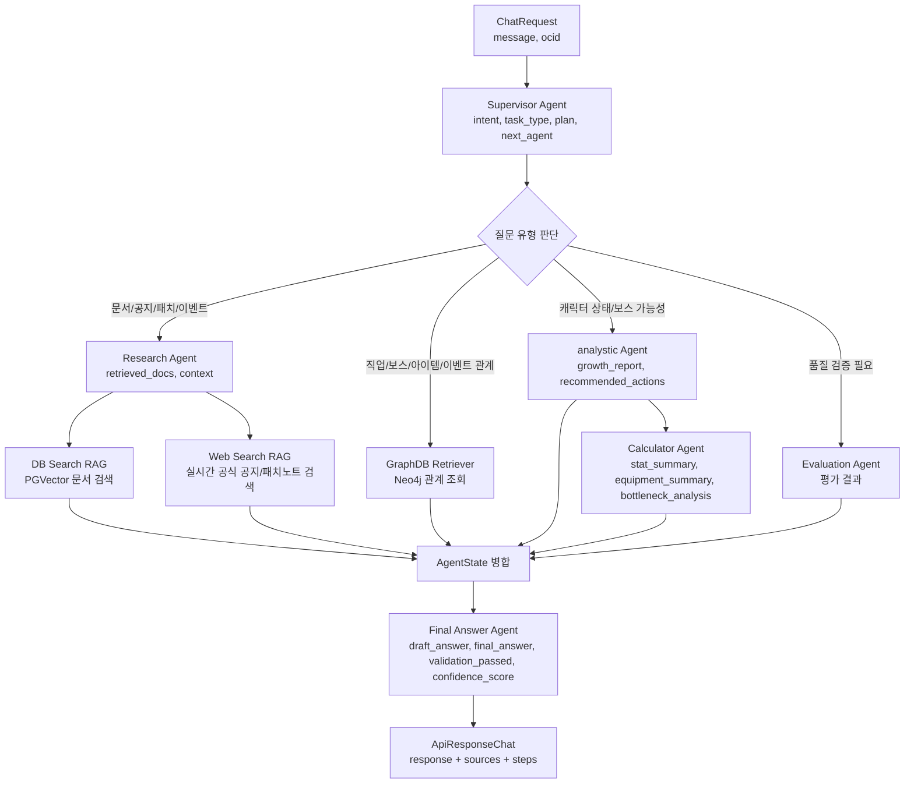
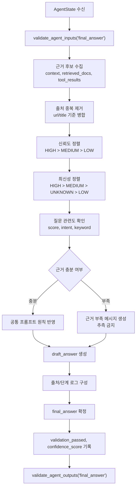
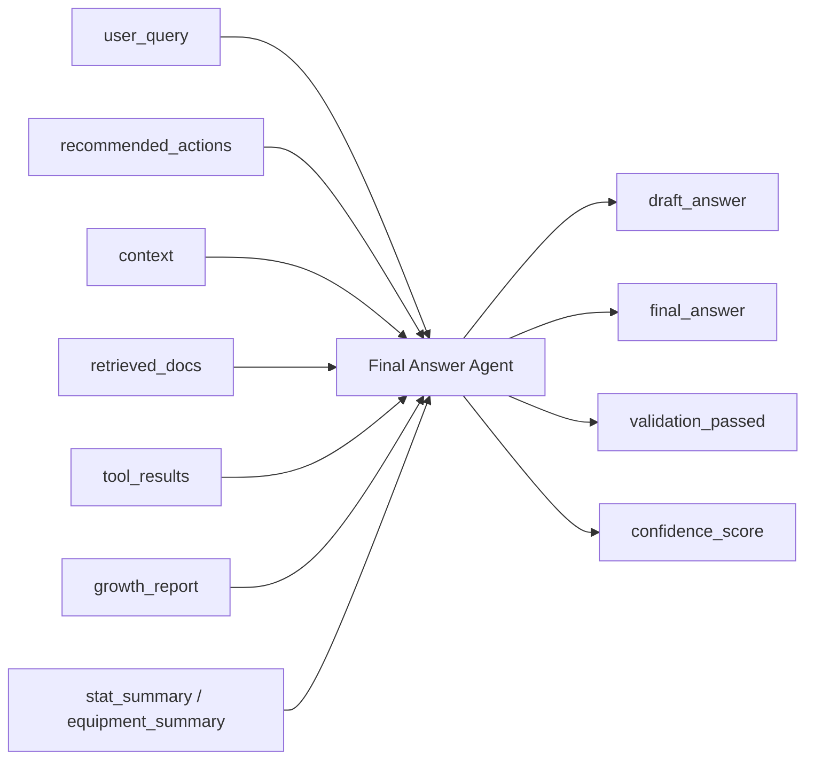

# Final Answer Agent 설계 문서

## 1. 목적

Final Answer Agent는 Supervisor, Research, DB Search RAG, Web Search RAG, GraphDB, analystic, Calculator, Evaluation Agent의 결과를 종합하여 사용자에게 최종 응답을 생성하는 에이전트이다.

본 에이전트는 새로운 데이터를 직접 수집하거나 계산하지 않는다. 각 에이전트가 `common/state.py`의 `AgentState`에 채운 결과를 검토하고, 근거의 신뢰도와 최신성을 판단한 뒤 `docs/openapi.yaml`의 `ApiResponseChat` 구조에 맞는 답변을 생성한다.

## 2. 설계 기준

| 기준 파일 | 적용 내용 |
|---|---|
| `common/domain.py` | `ProcessedCharacter`, `GrowthEfficiencyReport`, `ActionPlan`, `CharacterStatDetail` 등 공통 도메인 모델 기준 사용 |
| `common/state.py` | `AgentState`, `RetrievedDocument`, `AGENT_FIELD_CONTRACTS`를 입력/출력 계약으로 사용 |
| `common/validator.py` | Final Answer 입력/출력 state 검증 기준으로 사용 |
| `common/prompt.py` | 모르면 모른다고 답하고, state에 없는 정보는 추측하지 않는 원칙 반영 |
| `common/get_model.py` | LLM 호출이 필요한 구현 단계에서 공통 모델 헬퍼 기준 확인 |
| `common/logging_config.py` | 로그가 필요한 구현 단계에서 공통 로깅 설정 기준 확인 |
| `docs/요구사항정의서.csv` | Final Answer Agent와 연관된 기능 요구사항 및 수용 기준 반영 |
| `docs/openapi.yaml` | `ChatRequest`, `ApiResponseChat`, `Source` 응답 스키마 준수 |
| GraphDB 연동 결과 | Neo4j 조회 결과가 `tool_results`로 전달될 때 노드/관계 의미를 최종 답변 근거로 사용 |
| Web RAG 연동 결과 | Web RAG가 `retrieved_docs`, `context`, `reliability`, `freshness`, `published_at`을 제공하면 최종 답변 근거로 사용 |

`docs/graph_schema.md`, `docs/web_rag_design.md`는 담당 브랜치 병합 후 존재하면 세부 연동 기준으로 추가 확인한다.

## 3. 요구사항 매핑

| 요구사항 ID | 요구사항명 | Final Answer Agent 반영 방식 |
|---|---|---|
| `1.1` | 서비스 기획 | 메이플스토리 데이터를 기반으로 답변, 판단, 추천, 예측 결과를 사용자 응답으로 통합 |
| `3.1` | RAG 구축 - DB Search | PGVector/DB RAG가 반환한 문서 청크를 최종 답변 근거로 사용 |
| `3.2` | RAG 구축 - Web Search | 실시간 공식 공지 및 패치노트 검색 결과를 LLM 답변 context에 통합 |
| `3.3` | 그래프DB 연동 | Neo4j가 반환한 직업/보스/아이템/이벤트 관계를 판단 및 추천 근거로 사용 |
| `4.1` | 질의응답 기능 | 사용자 자연어 질문에 대해 관련 문서 기반 답변과 출처 생성 |
| `4.2` | 판단 기능 | 캐릭터 스탯/장비/유니온 분석 결과를 보스 도전 가능 여부 답변으로 변환 |
| `4.3` | 추천 기능 | 캐릭터 현황과 이벤트/콘텐츠 정보를 종합하여 성장 경로 추천을 자연어로 제공 |
| `4.5` | 출처 및 신뢰도 표시 | 답변에 `HIGH`, `MEDIUM`, `LOW` 신뢰도 등급이 포함된 출처 제공 |
| `5.1` | MultiAgent - Research | Research Agent의 `retrieved_docs`, `context`를 최종 답변에 반영 |
| `5.2` | MultiAgent - Analytic | 코드 기준 agent 이름은 `analystic`이며, `growth_report`, `recommended_actions`를 반영 |
| `5.3` | MultiAgent - Calculator | `stat_summary`, `equipment_summary`, `bottleneck_analysis` 수치 결과를 반영 |
| `5.4` | MultiAgent - Final Answer | 각 에이전트 결과를 종합하여 사용자에게 최종 응답 생성 |
| `5.5` | MultiAgent - Supervisor | `intent`, `task_type`, `plan`, `next_agent`를 응답 구성 기준으로 사용 |
| `6.1` | 모델 평가 - Evaluation | 평가 결과가 있을 경우 답변 품질 검토 및 재생성 판단에 사용 |
| `6.2` | 모델 평가 - RAGAS | Context Precision/Recall/Faithfulness 평가 결과를 추후 품질 관리에 반영 |
| `7.3` | 코드 통합 | RAG, Agent, DB, UI가 연결되는 End-to-End 응답 형식을 제공 |

## 4. 책임 범위

Final Answer Agent의 책임은 다음과 같다.

1. `user_query`, `intent`, `task_type`, `plan`을 확인한다.
2. `context`, `retrieved_docs`, `growth_report`, `recommended_actions`, `tool_results` 등 state 결과를 모아 답변 근거를 선별한다.
3. 공식 출처와 최신성이 높은 근거를 우선 사용한다.
4. 캐릭터 분석, 보스 판단, 추천, 예측 결과를 자연어로 통합한다.
5. 출처와 신뢰도를 함께 제공한다.
6. 근거가 부족하거나 충돌할 경우 확정 표현을 피하고 한계를 명시한다.
7. 내부 state에는 `draft_answer`, `final_answer`, `validation_passed`, `confidence_score`를 채운다.
8. API 계층으로 전달될 때는 `ApiResponseChat`의 `response`, `sources`, `steps` 형태로 변환될 수 있어야 한다.

Final Answer Agent가 하지 않는 일은 다음과 같다.

| 제외 작업 | 담당 모듈 |
|---|---|
| NEXON Open API 직접 호출 | `src/collectors/`, 캐릭터 조회 서비스 |
| Web 검색 실행 | `src/rag/web_search.py`, Research Agent |
| Neo4j 관계 조회 | GraphDB Retriever |
| 전투력/딜 계산 | Calculator Agent |
| RAG 품질 평가 | Evaluation/RAGAS Agent |
| 사용자 UI 렌더링 | Streamlit Chatbot |

## 5. 입력 데이터

Final Answer Agent의 필수 입력은 `common/state.py`의 `AGENT_FIELD_CONTRACTS["final_answer"]`를 따른다.

| 필드 | 설명 |
|---|---|
| `user_query` | 사용자의 원문 질문 |
| `recommended_actions` | `ActionPlan` 목록 기반 추천 결과 |
| `context` | Research/Web RAG/DB RAG가 구성한 답변 근거 문자열 |

추가로 사용할 수 있는 state 필드는 다음과 같다.

| 필드 | 설명 |
|---|---|
| `intent` | Supervisor가 분류한 질문 의도 |
| `task_type` | 작업 유형 |
| `plan` | Supervisor 작업 계획 |
| `retrieved_docs` | `RetrievedDocument` 목록 |
| `tool_results` | Web RAG, GraphDB, Evaluation 등 외부 도구 결과 |
| `character_profile` | `ProcessedCharacter` |
| `character_stats` | `CharacterStatDetail` |
| `equipment_items` | `EquipmentDetail` 목록 |
| `union_status` | `UnionStatus` |
| `stat_summary` | Calculator Agent의 스탯 요약 |
| `equipment_summary` | Calculator Agent의 장비 요약 |
| `bottleneck_analysis` | 병목 분석 결과 |
| `growth_report` | `GrowthEfficiencyReport` |

## 6. 출력 데이터

Final Answer Agent의 필수 출력은 `common/state.py`의 `AGENT_FIELD_CONTRACTS["final_answer"]`를 따른다.

| 필드 | 설명 |
|---|---|
| `draft_answer` | LLM 또는 템플릿으로 만든 초안 답변 |
| `final_answer` | 검토 후 사용자에게 제공할 최종 답변 |
| `validation_passed` | 필수 근거와 형식 검증 통과 여부 |
| `confidence_score` | 답변 신뢰도 점수 |

API 응답은 `docs/openapi.yaml`의 `ApiResponseChat` 구조와 호환되어야 한다.

```json
{
  "success": true,
  "message": "챗봇 응답 메시지 반환",
  "confidence": 0.82,
  "data": {
    "response": "최종 답변 본문",
    "sources": [
      {
        "title": "메이플스토리 공식 이벤트",
        "url": "https://maplestory.nexon.com/...",
        "reliability": "HIGH"
      }
    ],
    "steps": [
      {
        "agent": "research",
        "action": "retrieve",
        "log": "공식 문서 context 구성"
      },
      {
        "agent": "final_answer",
        "action": "synthesize",
        "log": "공식 출처와 최신성을 기준으로 최종 답변 생성"
      }
    ]
  }
}
```

`Source.reliability`는 `docs/openapi.yaml`의 enum을 따른다.

```text
HIGH
MEDIUM
LOW
```

## 7. 처리 흐름

### 7.1 전체 MultiAgent 흐름



### 7.2 Final Answer 내부 처리 흐름



### 7.3 AgentState 데이터 흐름



## 8. 근거 우선순위

| 우선순위 | 기준 |
|---|---|
| 1 | 공식 출처 `reliability = HIGH` |
| 2 | 최신성 `freshness = HIGH` |
| 3 | 사용자 질문과 관련도 점수 높은 context |
| 4 | GraphDB/DB RAG에서 구조화된 근거가 있는 결과 |
| 5 | 커뮤니티/보조 자료 `reliability = MEDIUM` |
| 6 | 날짜 미상 또는 오래된 자료 |

공식 출처와 커뮤니티 출처가 충돌하면 공식 출처를 우선한다. 단, 공식 출처가 오래된 자료이고 최신 커뮤니티 자료만 존재할 경우에는 확정 답변을 피하고 최신 공식 공지 확인이 필요하다고 표현한다.

## 9. 답변 생성 원칙

1. `common/prompt.py` 기준으로 state에 없는 정보는 추측하지 않는다.
2. 모르면 모른다고 답한다.
3. 계산 결과와 추천 이유를 분리한다.
4. 불확실한 내용은 근거와 한계를 함께 말한다.
5. 공식 문서 기반 답변은 근거 범위 안에서 명확하게 말할 수 있다.
6. 커뮤니티 문서 기반 답변은 보조 자료 또는 참고 자료로 표현한다.
7. 예측 기능은 반드시 “예상”, “가능성”으로 표현한다.
8. 캐릭터 분석 결과는 `ProcessedCharacter`와 `GrowthEfficiencyReport` 기준으로 설명한다.
9. 추천은 `ActionPlan.priority`가 낮은 숫자일수록 우선순위가 높다고 해석한다.
10. 계산 결과는 Calculator Agent의 수치를 임의로 재계산하지 않는다.
11. `sources`에는 가능한 한 출처를 포함하고, 근거가 없으면 근거 부족을 명시한다.
12. Nexon API 데이터는 요구사항의 제약사항에 따라 약 15분 지연 가능성이 있음을 필요한 경우 답변에 반영한다.

## 10. 프롬프트 설계

Final Answer Agent가 LLM에 전달하는 시스템 프롬프트는 `common/prompt.py`의 `master_prompt`를 우선 포함하고, 다음 정책을 추가한다.

```text
당신은 메이플스토리 RAG 멀티 에이전트 챗봇의 Final Answer Agent입니다.
제공된 AgentState와 근거 context만 사용하여 답변하세요.
공식 출처와 최신성이 높은 근거를 우선 사용하세요.
근거가 부족한 내용은 추측하지 말고 한계를 명시하세요.
출처는 title, url, reliability를 포함해 반환하세요.
커뮤니티 자료는 공식 자료가 없을 때만 보조 근거로 사용하세요.
예측은 확정 정보처럼 말하지 마세요.
```

사용자 프롬프트에는 다음 정보를 구조화해서 넣는다.

```text
[사용자 질문]
{user_query}

[Supervisor 계획]
{intent}
{task_type}
{plan}

[검색 근거]
{context}

[검색 문서 메타데이터]
{retrieved_docs}

[분석/추천 결과]
{growth_report}
{recommended_actions}

[계산 결과]
{stat_summary}
{equipment_summary}
{bottleneck_analysis}

[도구 결과]
{tool_results}

[응답 형식]
ApiResponseChat.data.response, sources, steps로 변환 가능한 답변을 생성하세요.
```

## 11. 질문 유형별 응답 전략

| 질문 유형 | 사용 근거 | 답변 전략 |
|---|---|---|
| 공식 공지/이벤트/패치 질문 | `context`, `retrieved_docs`, Web RAG 결과 | 최신 공식 문서를 우선 요약하고 출처 제공 |
| 캐릭터 상태 분석 | `character_profile`, `growth_report`, `stat_summary` | 현재 스펙, 부족 항목, 도전 가능 여부 설명 |
| 장비/성장 추천 | `recommended_actions`, `equipment_summary`, GraphDB 결과 | 우선순위와 예상 효과 중심으로 설명 |
| 보스 가능성 판단 | `growth_report.boss_clear_prediction`, GraphDB 결과 | 가능/주의/부족 스탯을 분리해 설명 |
| 단순 정보 질문 | `context`, `retrieved_docs` | 핵심 정의와 관련 출처 제공 |
| 예측 질문 | Web RAG, 패치 흐름, Evaluation 결과 | 확정이 아닌 가능성으로 표현 |

## 12. 단계 로그 설계

`ApiResponseChat.data.steps`에는 디버깅과 평가를 위해 주요 단계만 남긴다.

| agent | action | log 예시 |
|---|---|---|
| `supervisor` | `plan` | 질문 유형을 이벤트 정보 검색으로 분류 |
| `research` | `retrieve` | 공식 문서 context 구성 |
| `web_rag` | `search` | 공식 문서 3건 검색, 최신성 HIGH 1건 |
| `graphdb` | `query` | 관련 보스/아이템 관계 조회 |
| `analystic` | `analyze` | 캐릭터 스탯 기반 병목 분석 |
| `calculator` | `calculate` | 예상 전투력 상승치 계산 |
| `final_answer` | `synthesize` | 공식 근거를 우선하여 최종 응답 생성 |

## 13. 수용 기준

| 요구사항 | 수용 기준 |
|---|---|
| 문서 기반 Q&A | 사용자 질문에 대해 관련 문서 context를 활용한 답변을 생성한다 |
| 출처 포함 답변 | `sources`에 출처를 포함한다. 근거가 없으면 근거 부족을 명시한다 |
| 신뢰도 표시 | 모든 source는 `HIGH`, `MEDIUM`, `LOW` 중 하나의 신뢰도 값을 가진다 |
| Web Search 통합 | Web RAG 결과의 공식 공지, 패치노트, 이벤트 context를 LLM 프롬프트에 포함한다 |
| DB Search 통합 | DB RAG 결과가 있으면 Web RAG와 함께 근거 후보로 정렬한다 |
| GraphDB 통합 | 직업/보스/아이템/이벤트 관계 조회 결과가 있으면 판단/추천 근거로 사용한다 |
| 분석 결과 통합 | analystic Agent의 캐릭터 상태 진단과 병목 분석을 답변에 반영한다 |
| 계산 결과 통합 | Calculator Agent의 딜/성장 수치 결과를 임의 변경 없이 반영한다 |
| Final Answer state 출력 | `draft_answer`, `final_answer`, `validation_passed`, `confidence_score`를 채운다 |
| API 응답 호환 | `response`, `sources`, `steps`를 포함한 `ApiResponseChat` 호환 dict로 변환 가능하다 |

## 14. 검증 기준

| 검증 항목 | 기준 |
|---|---|
| state 입력 검증 | `validate_agent_inputs("final_answer", state)` 통과 |
| state 출력 검증 | `validate_agent_outputs("final_answer", state)` 통과 |
| API 스키마 정합성 | `response`, `sources`, `steps` 필드 포함 |
| 출처 신뢰도 | `HIGH`, `MEDIUM`, `LOW` 중 하나 |
| 근거 기반성 | 답변 내용이 입력 context 또는 state에 존재 |
| 최신성 | 이벤트/패치 질문은 `freshness`가 높은 문서 우선 |
| 충돌 처리 | 공식 문서와 보조 문서 충돌 시 공식 문서 우선 |
| 예측 표현 | 예측 질문은 확정 표현 금지 |
| 캐릭터 분석 | domain 모델 필드 기준으로 설명 |

## 15. 1차 구현 범위

1차 구현에서는 다음 범위까지만 처리한다.

1. `AgentState` dict를 입력으로 받는다.
2. `validate_agent_inputs("final_answer", state)`를 통과하도록 필수 입력을 확인한다.
3. `context`, `retrieved_docs`, `tool_results`를 신뢰도와 최신성 기준으로 정렬한다.
4. `common/prompt.py`의 원칙을 포함해 LLM 프롬프트를 구성한다.
5. LLM 또는 템플릿 기반 초안을 `draft_answer`에 저장한다.
6. 검토된 최종 답변을 `final_answer`에 저장한다.
7. `validation_passed`, `confidence_score`를 기록한다.
8. API 계층에서 `ApiResponseChat` 형태로 변환할 수 있도록 출처와 단계 로그를 함께 구성한다.

추후 구현에서는 Evaluation Agent 결과를 받아 답변 재생성 여부를 결정하고, RAGAS 점수 또는 자체 평가 점수를 함께 기록할 수 있다.

## 16. 파일 배치

권장 파일 위치는 다음과 같다.

```text
src/agents/final_answer.py
```

주요 함수 후보는 다음과 같다.

```python
from common.state import AgentState


def build_final_answer_prompt(state: AgentState) -> str:
    ...


def rank_sources(state: AgentState) -> list[dict]:
    ...


def generate_final_answer(state: AgentState) -> AgentState:
    ...
```

실제 구현 시 API 키와 민감 정보는 `os.environ.get()` 또는 기존 공통 헬퍼를 통해 가져온다. `.env`에 API 키를 직접 하드코딩하지 않으며, `.env.example`에는 더미값만 작성한다.
