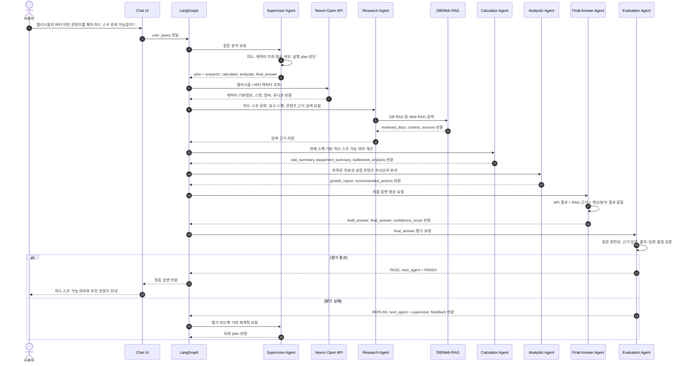

```mermaid
sequenceDiagram
    autonumber

    actor User as 사용자
    participant UI as Chat UI
    participant Graph as LangGraph
    participant Supervisor as Supervisor Agent
    participant NexonAPI as Nexon Open API
    participant Research as Research Agent
    participant RAG as DB/Web RAG
    participant Calculator as Calculator Agent
    participant Analystic as Analystic Agent
    participant Final as Final Answer Agent
    participant Eval as Evaluation Agent

    User->>UI: 엘리시움의 버터 어떤 콘텐츠를 해야 하드 스우 공략 가능할까?
    UI->>Graph: user_query 전달

    Graph->>Supervisor: 질문 분석 요청
    Supervisor->>Supervisor: 의도, 캐릭터 조회 필요 여부, 실행 plan 판단
    Supervisor-->>Graph: plan = research, calculator, analystic, final_answer

    Graph->>NexonAPI: 엘리시움 / 버터 캐릭터 조회
    NexonAPI-->>Graph: 캐릭터 기본정보, 스탯, 장비, 유니온 반환

    Graph->>Research: 하드 스우 공략, 요구 스펙, 콘텐츠 근거 검색 요청
    Research->>RAG: DB RAG 및 Web RAG 검색
    RAG-->>Research: retrieved_docs, context, sources 반환
    Research-->>Graph: 검색 근거 저장

    Graph->>Calculator: 현재 스펙 기반 하드 스우 가능 여부 계산
    Calculator-->>Graph: stat_summary, equipment_summary, bottleneck_analysis 반환

    Graph->>Analystic: 부족한 부분과 성장 콘텐츠 우선순위 분석
    Analystic-->>Graph: growth_report, recommended_actions 반환

    Graph->>Final: 최종 답변 생성 요청
    Final->>Final: API 결과 + RAG 근거 + 계산/분석 결과 종합
    Final-->>Graph: draft_answer, final_answer, confidence_score 반환

    Graph->>Eval: final_answer 평가 요청
    Eval->>Eval: 질문 관련성, 근거 일치, 출처, 답변 품질 검증

    alt 평가 통과
        Eval-->>Graph: PASS, next_agent = FINISH
        Graph-->>UI: 최종 답변 반환
        UI-->>User: 하드 스우 가능 여부와 추천 콘텐츠 안내
    else 평가 실패
        Eval-->>Graph: REPLAN, next_agent = supervisor, feedback 반환
        Graph->>Supervisor: 평가 피드백 기반 재계획 요청
        Supervisor-->>Graph: 보완 plan 반환
    end
```
